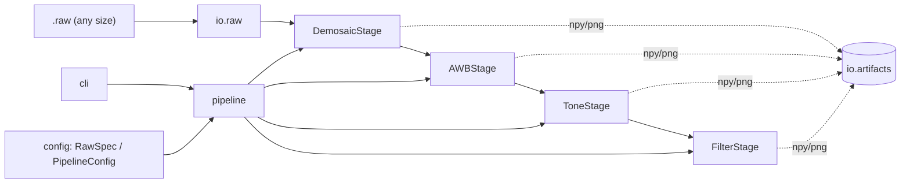

# dippipe — simple DIP pipeline

[](README.md) [](README.ru.md)

A small, packaged image signal processing (ISP) pipeline grown out of a set of
digital image processing labs. It reads raw Bayer captures and runs them
through demosaicing, automatic white balance, tone mapping and spatial
filtering. Each step can be run independently and its result saved.

Originally a pair of throwaway scripts (`main.py` + `funcs.py`), now a proper
installable wheel.

## Features

- **Universal RAW reading** — read a frame of *any* size from a headerless
  multi-frame `.raw`; geometry can be given explicitly or inferred from the
  file size. Supports 8/10/12/16-bit and all four Bayer patterns.
- **Independent, resumable stages** — run the whole pipeline or any single
  step; every result is persisted as `.npy` (+ `.png` preview).
- **Optimized filters** — separable Gaussian and a vectorized windowed
  bilateral filter (runs on full images, not a 20×20 crop). Reference naive
  implementations are kept for comparison.
- **Clear architecture** — algorithms, IO, stages, pipeline and CLI are cleanly
  separated.

## Installation

From a built wheel (no PyPI required):

```bash
pip install dist/dippipe-0.3.0-py3-none-any.whl
```

Or from source:

```bash
pip install .
```

## Sample data (Git LFS)

The repository ships nine sample captures under `examples/` (each a 1280×1024,
12-bit, 10-frame RGGB capture, ~25 MB), stored via
[Git LFS](https://git-lfs.com/). They are **not** included in the wheel/sdist —
only in version control.

Install Git LFS once, then clone or pull as usual:

```bash
git lfs install            # one-time, sets up the LFS filters
git clone <repo-url>       # LFS files are fetched automatically
```

If you cloned before installing LFS (the file will be a small text pointer),
download the real content with:

```bash
git lfs pull
```

The usage examples in `src/usage/` use `dump_white_color_10_frames.raw` from
`examples/`.

## Architecture



| Layer | Module | Responsibility |
|-------|--------|----------------|
| Config | `dippipe.config` | `RawSpec`, `PipelineConfig` (typed parameters) |
| IO | `dippipe.io.raw` | universal RAW reading + geometry inference |
| IO | `dippipe.io.artifacts` | save/load `.npy` results and `.png` previews |
| Color | `dippipe.color` | RGB ↔ YCbCr |
| Stages | `dippipe.stages.*` | demosaic, AWB, tone, filtering algorithms |
| Stages | `dippipe.stages.steps` | `Stage` subclasses adapting algorithms |
| Orchestration | `dippipe.pipeline` | stage registry + runner (with resume) |
| Entry point | `dippipe.cli` | argparse subcommands |

## CLI usage

Run the full pipeline:

```bash
dippipe run-all capture.raw -o out/ --width 1280 --height 1024 --bit-depth 12 --pattern RGGB
```

Run stages independently (each reads/writes a `.npy` artifact):

```bash
dippipe demosaic capture.raw -o 01_rgb.npy --width 1280 --height 1024
dippipe awb      01_rgb.npy  -o 02_awb.npy  --method combine
dippipe tone     02_awb.npy  -o 03_tone.npy --gamma 0.4545
dippipe filter   03_tone.npy -o 04_out.npy  --gaussian-sigma 10 --radius 5
```

Resume a partially completed run (skips stages whose artifact exists):

```bash
dippipe run-all capture.raw -o out/ --width 1280 --height 1024 --resume
```

## Library usage

```python
from dippipe import RawSpec, read_raw, demosaic, build_default_pipeline, PipelineConfig

spec = RawSpec(width=1280, height=1024, bit_depth=12, frame_index=1)
frame = read_raw("capture.raw", spec)

rgb = demosaic(frame, spec.bayer_pattern)

pipeline = build_default_pipeline(PipelineConfig(raw=spec))
final = pipeline.run(frame, out_dir="out/")
```

## Development

This project uses [PDM](https://pdm-project.org/).

```bash
pdm install -dG test   # install runtime + test dependencies
pdm run pytest         # run the test suite
pdm build              # build the wheel and sdist into dist/
```
