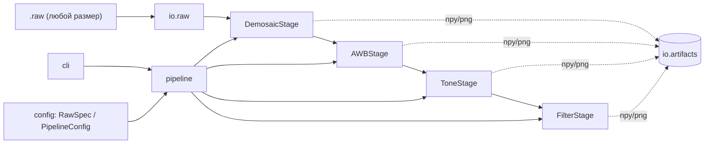

# dippipe — simple DIP pipeline

[](README.md) [](README.ru.md)

Небольшой упакованный конвейер обработки изображений (ISP), выросший из набора
лабораторных работ по цифровой обработке изображений. Он читает сырые Bayer-кадры
и прогоняет их через демозайкинг, автоматический баланс белого, тональную
коррекцию и пространственную фильтрацию. Каждый шаг можно запускать независимо и
сохранять результат.

Изначально — пара одноразовых скриптов (`main.py` + `funcs.py`), теперь —
полноценный устанавливаемый wheel.

## Возможности

- **Универсальное чтение RAW** — чтение кадра *любого* размера из headerless
  многокадрового `.raw`; геометрию можно задать явно или вывести из размера
  файла. Поддержка 8/10/12/16 бит и всех четырёх паттернов Байера.
- **Независимые, возобновляемые этапы** — запуск всего конвейера или любого
  отдельного шага; каждый результат сохраняется как `.npy` (+ `.png`-превью).
- **Оптимизированные фильтры** — сепарабельный гаусс и векторизованный оконный
  билатеральный фильтр (работает на полных изображениях, а не на кропе 20×20).
  Эталонные наивные реализации сохранены для сравнения.
- **Понятная архитектура** — алгоритмы, IO, этапы, конвейер и CLI чётко
  разделены.

## Установка

Из собранного wheel (PyPI не требуется):

```bash
pip install dist/dippipe-0.3.0-py3-none-any.whl
```

Или из исходников:

```bash
pip install .
```

## Тестовые данные (Git LFS)

В репозитории поставляется девять тестовых кадров в каталоге `examples/`
(каждый — 1280×1024, 12 бит, 10 кадров, паттерн RGGB, ~25 МБ), хранящихся через
[Git LFS](https://git-lfs.com/). В wheel/sdist они **не** входят — только в
систему контроля версий.

Один раз установите Git LFS, затем клонируйте или подтягивайте изменения как
обычно:

```bash
git lfs install            # однократно, настраивает фильтры LFS
git clone <repo-url>       # файлы LFS скачиваются автоматически
```

Если вы клонировали до установки LFS (файл окажется маленьким текстовым
указателем), скачайте реальное содержимое командой:

```bash
git lfs pull
```

Примеры в `src/usage/` используют `dump_white_color_10_frames.raw` из каталога
`examples/`.

## Архитектура



| Слой | Модуль | Ответственность |
|------|--------|-----------------|
| Конфиг | `dippipe.config` | `RawSpec`, `PipelineConfig` (типизированные параметры) |
| IO | `dippipe.io.raw` | универсальное чтение RAW + вывод геометрии |
| IO | `dippipe.io.artifacts` | сохранение/загрузка `.npy` и `.png`-превью |
| Цвет | `dippipe.color` | RGB ↔ YCbCr |
| Этапы | `dippipe.stages.*` | алгоритмы демозайкинга, AWB, тона, фильтрации |
| Этапы | `dippipe.stages.steps` | подклассы `Stage`, адаптирующие алгоритмы |
| Оркестрация | `dippipe.pipeline` | реестр этапов + раннер (с возобновлением) |
| Точка входа | `dippipe.cli` | подкоманды argparse |

## Использование CLI

Запуск всего конвейера:

```bash
dippipe run-all capture.raw -o out/ --width 1280 --height 1024 --bit-depth 12 --pattern RGGB
```

Запуск этапов независимо (каждый читает/пишет `.npy`-артефакт):

```bash
dippipe demosaic capture.raw -o 01_rgb.npy --width 1280 --height 1024
dippipe awb      01_rgb.npy  -o 02_awb.npy  --method combine
dippipe tone     02_awb.npy  -o 03_tone.npy --gamma 0.4545
dippipe filter   03_tone.npy -o 04_out.npy  --gaussian-sigma 10 --radius 5
```

Возобновление частично выполненного прогона (пропускает этапы, чьи артефакты уже
существуют):

```bash
dippipe run-all capture.raw -o out/ --width 1280 --height 1024 --resume
```

## Использование как библиотеки

```python
from dippipe import RawSpec, read_raw, demosaic, build_default_pipeline, PipelineConfig

spec = RawSpec(width=1280, height=1024, bit_depth=12, frame_index=1)
frame = read_raw("capture.raw", spec)

rgb = demosaic(frame, spec.bayer_pattern)

pipeline = build_default_pipeline(PipelineConfig(raw=spec))
final = pipeline.run(frame, out_dir="out/")
```

## Разработка

Проект использует [PDM](https://pdm-project.org/).

```bash
pdm install -dG test   # установить runtime- и тестовые зависимости
pdm run pytest         # прогнать тесты
pdm build              # собрать wheel и sdist в dist/
```
